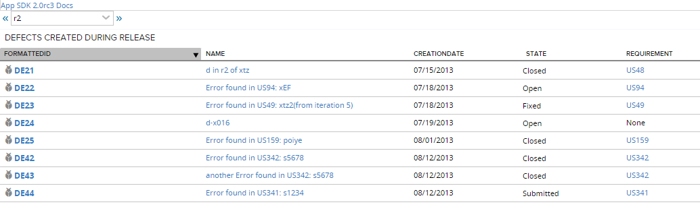

Defects created during Release
=========================

## Overview

Defects created during Release are not automatically scheduled for Release. This grid shows defects with CreationDate that falls between Start and Release Dates
## License
This app is available on AS IS basis. It is not supported by Rally support.
AppTemplate is released under the MIT license.  See the file [LICENSE](./LICENSE) for the full text.

##Documentation for SDK

You can find the documentation on our help [site.](https://help.rallydev.com/apps/2.0rc3/doc/)
